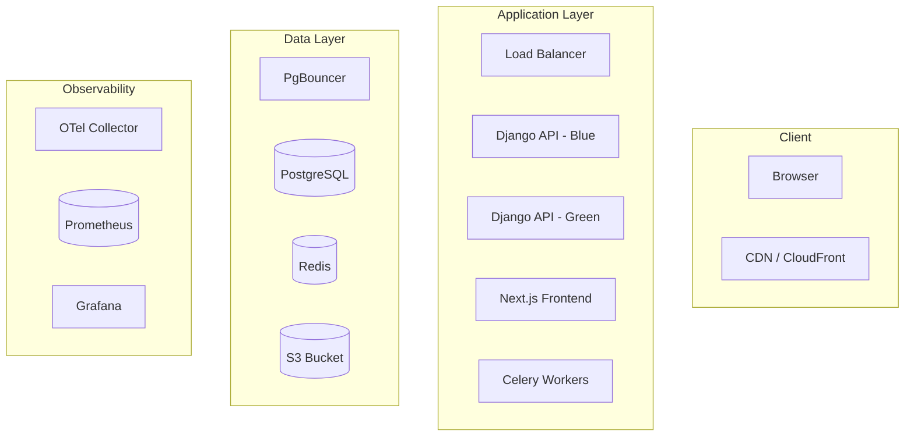

# Project: Production Launch

This is it. The final project. Everything you've built across nine modules comes together here.

Your mission: prove that Gather is production-ready. Not "it works on localhost" ready. Not "the tests pass" ready. Production ready, meaning you can demonstrate with evidence that the system handles real traffic, degrades gracefully under failure, and has the observability and documentation needed for a team to operate it.

You will:

1. Write and run a Locust load test simulating 1,000 concurrent users
2. Hit specific performance targets under load
3. Verify graceful degradation by killing Redis during a load test
4. Capture Grafana dashboard screenshots showing metrics under load
5. Complete a production launch checklist with real values
6. Write runbooks for the top 3 failure scenarios
7. Create a final architecture diagram showing all components

This project has no single "right answer." Your load test numbers will depend on your hardware. Your architecture diagram will reflect the specific decisions you made throughout the course. Your runbooks will address the failures you've seen in your environment. The goal is to demonstrate systematic, evidence-based confidence that your system is ready.

## Deliverables

By the end of this project, you will have produced:

| Deliverable | Format | Description |
|---|---|---|
| Locust test suite | Python file(s) | Realistic load test with multiple user types |
| Load test results | Locust HTML report | Evidence of performance under 1,000 concurrent users |
| Graceful degradation proof | Screenshots + notes | Evidence that the system survives Redis failure |
| Grafana dashboards | Screenshots | Metrics during load test (request rate, latency, errors, resources) |
| Production launch checklist | Completed Markdown | Every item verified with actual values |
| Runbooks | Markdown document | Step-by-step guides for top 3 failure scenarios |
| Architecture diagram | Image or diagram file | Complete system architecture with all components |

## Part 1: Locust Load Test Suite (45 minutes)

Create a load test that simulates realistic Gather usage with 1,000 concurrent users.

### Starter Code

Create a file at `gather/loadtests/locustfile.py`:

```python
"""
Gather Load Test Suite
======================
Simulates realistic user behavior against the Gather API.

User distribution:
  - 70% Browsers: browse events, view details, search
  - 25% Active Users: browse + RSVP + view own RSVPs
  - 5% Organizers: manage events, upload images, view analytics

Run:
  locust -f locustfile.py --host=http://localhost:8000

Headless (for CI):
  locust -f locustfile.py --host=http://localhost:8000 \
    --headless --users 1000 --spawn-rate 50 \
    --run-time 15m --html report.html
"""

from locust import HttpUser, task, between, events, LoadTestShape
import json
import random
import logging
import time

logger = logging.getLogger(__name__)


# ---------------------------------------------------------------------------
# Test data
# ---------------------------------------------------------------------------
SEARCH_KEYWORDS = ["python", "javascript", "react", "django", "community",
                   "workshop", "hackathon", "networking", "career", "design"]


# ---------------------------------------------------------------------------
# Helper: authenticate a test user
# ---------------------------------------------------------------------------
def login_user(client, user_type, user_index):
    """
    Log in a test user and return the auth token.
    Assumes test users were seeded in the database:
      loadtest-browser-0@test.com through loadtest-browser-999@test.com
      loadtest-active-0@test.com through loadtest-active-999@test.com
      loadtest-organizer-0@test.com through loadtest-organizer-999@test.com
    All with password: testpassword123
    """
    # TODO: Send a POST request to /api/auth/login/ with the test user
    # credentials. Parse the response to extract the auth token.
    # Set the token in client.headers for subsequent requests.
    # Handle login failure gracefully (log a warning, don't crash).
    pass


# ---------------------------------------------------------------------------
# Helper: fetch a pool of event IDs for use in subsequent requests
# ---------------------------------------------------------------------------
def fetch_event_ids(client, count=50):
    """
    Fetch a list of event IDs from the API.
    Returns a list of integer IDs, or a fallback range if the request fails.
    """
    # TODO: GET /api/events/?limit={count} and parse the response.
    # Extract the "id" field from each event in the results.
    # If the request fails, return list(range(1, count + 1)) as fallback.
    # Use the name parameter to group these requests in Locust stats:
    #   name="/api/events/?limit=[N]"
    return list(range(1, count + 1))


# ---------------------------------------------------------------------------
# User Type 1: Browser (70% of traffic)
# ---------------------------------------------------------------------------
class GatherBrowser(HttpUser):
    """
    Casual user who browses events and views details.
    Does not write any data.
    """
    weight = 70
    wait_time = between(2, 5)

    def on_start(self):
        """Set up the user session: login and fetch event pool."""
        login_user(self.client, "browser", id(self) % 1000)
        self.event_ids = fetch_event_ids(self.client)

    # TODO: Implement browse_event_list task (weight 5)
    # - GET /api/events/ with a random page (1-10) and page_size=20
    # - Use the name parameter: name="/api/events/?page=[N]"

    # TODO: Implement view_event_detail task (weight 3)
    # - Pick a random event ID from self.event_ids
    # - GET /api/events/{event_id}/
    # - Use the name parameter: name="/api/events/[id]/"

    # TODO: Implement search_events task (weight 1)
    # - Pick a random keyword from SEARCH_KEYWORDS
    # - GET /api/events/?search={keyword}
    # - Use the name parameter: name="/api/events/?search=[kw]"


# ---------------------------------------------------------------------------
# User Type 2: Active User (25% of traffic)
# ---------------------------------------------------------------------------
class GatherActiveUser(HttpUser):
    """
    Engaged user who browses events and RSVPs to them.
    Performs both read and write operations.
    """
    weight = 25
    wait_time = between(1, 3)

    def on_start(self):
        login_user(self.client, "active", id(self) % 1000)
        self.event_ids = fetch_event_ids(self.client)

    # TODO: Implement browse_events task (weight 4)
    # - GET /api/events/ with random page (1-5)
    # - Use name="/api/events/?page=[N]"

    # TODO: Implement view_event_detail task (weight 3)
    # - Pick random event, GET /api/events/{event_id}/
    # - Use name="/api/events/[id]/"

    # TODO: Implement rsvp_to_event task (weight 2)
    # - Pick a random event ID from self.event_ids
    # - POST /api/events/{event_id}/rsvp/
    # - Use name="/api/events/[id]/rsvp/"
    # - Log whether the RSVP succeeded or if the user was already RSVP'd

    # TODO: Implement view_my_rsvps task (weight 1)
    # - GET /api/users/me/rsvps/


# ---------------------------------------------------------------------------
# User Type 3: Organizer (5% of traffic)
# ---------------------------------------------------------------------------
class GatherOrganizer(HttpUser):
    """
    Event organizer who manages events and uploads images.
    Performs management operations with longer think time.
    """
    weight = 5
    wait_time = between(3, 8)

    def on_start(self):
        login_user(self.client, "organizer", id(self) % 100)

    # TODO: Implement browse_own_events task (weight 3)
    # - GET /api/users/me/events/

    # TODO: Implement view_event_analytics task (weight 2)
    # - Pick a random event ID (1-20, organizers have fewer events)
    # - GET /api/events/{event_id}/analytics/
    # - Use name="/api/events/[id]/analytics/"

    # TODO: Implement upload_event_image task (weight 1)
    # - POST /api/uploads/presigned-url/ with JSON body:
    #   {"filename": "event-banner.jpg", "content_type": "image/jpeg"}
    # - We only test the presigned URL generation, not the actual S3 upload
    # - Log success or failure


# ---------------------------------------------------------------------------
# Custom Load Shape: Stepped Ramp
# ---------------------------------------------------------------------------
class GatherLoadShape(LoadTestShape):
    """
    Stepped ramp pattern for systematic load testing:

    Phase 1 (0-2 min):   Ramp to 200 users    (smoke test)
    Phase 2 (2-5 min):   Hold at 200           (baseline)
    Phase 3 (5-7 min):   Ramp to 500 users     (moderate load)
    Phase 4 (7-10 min):  Hold at 500           (sustained load)
    Phase 5 (10-12 min): Ramp to 1,000 users   (target load)
    Phase 6 (12-17 min): Hold at 1,000         (target sustained)
    Phase 7 (17-19 min): Ramp to 1,500 users   (stress test)
    Phase 8 (19-22 min): Hold at 1,500         (breaking point)
    Phase 9 (22-25 min): Ramp down to 0        (recovery)
    """

    # TODO: Define the phases as a list of tuples:
    #   (duration_seconds, target_users, spawn_rate)
    # Example: (120, 200, 50) means "over 120 seconds, ramp to 200 users
    # at 50 users/second"
    #
    # Implement the tick() method:
    # - Calculate elapsed time with self.get_run_time()
    # - Determine which phase we're in based on cumulative durations
    # - Return (target_users, spawn_rate) for the current phase
    # - Return None when all phases are complete (stops the test)

    def tick(self):
        pass


# ---------------------------------------------------------------------------
# Event hooks: log summary at test end
# ---------------------------------------------------------------------------
@events.quitting.add_listener
def on_quitting(environment, **kwargs):
    """Print a summary when the test ends."""
    # TODO: Access environment.stats to print:
    # - Total requests made
    # - Total failures
    # - Overall failure percentage
    # - If failure rate > 1%, log a warning that the test did not pass
    pass
```

### What to Implement

Fill in every `# TODO:` marker. Each one has specific instructions. When you're done, the load test should:

1. Simulate three types of users (browser, active, organizer) in realistic proportions
2. Perform authenticated requests against all major Gather endpoints
3. Follow a stepped ramp pattern from 0 to 1,500 users
4. Group requests by endpoint pattern (using the `name` parameter)
5. Print a summary at test end

### Seeding Test Data

Before running the load test, you need test users in the database. Create a management command or script:

```python
# gather/management/commands/seed_loadtest_users.py

# TODO: Create test users for load testing
# - 1000 browser users: loadtest-browser-0@test.com through loadtest-browser-999@test.com
# - 1000 active users: loadtest-active-0@test.com through loadtest-active-999@test.com
# - 100 organizer users: loadtest-organizer-0@test.com through loadtest-organizer-99@test.com
# All with password: testpassword123
# Use bulk_create for efficiency
# Also seed 10,000 events and 200,000 RSVPs if the database is empty
```

## Part 2: Run Load Test and Hit Targets (20 minutes)

Run your load test and verify these performance targets are met at 1,000 concurrent users:

| Metric | Target | Your Result |
|---|---|---|
| Event listing p95 response time | < 500ms | ___ ms |
| RSVP creation p95 response time | < 1,000ms | ___ ms |
| Error rate | < 0.1% | ___ % |
| Requests per second (sustained) | > 400 RPS | ___ RPS |
| Zero data loss | No failed writes that should have succeeded | Pass / Fail |

### How to Run

```bash
# Make sure Gather is running with all services
docker compose up -d

# Seed test data (if not already done)
docker compose exec api python manage.py seed_loadtest_users

# Run the load test (headless, 15 minutes, generates HTML report)
cd gather/loadtests
locust -f locustfile.py \
  --host=http://localhost:8000 \
  --headless \
  --run-time 25m \
  --html report.html
```

### If You Miss a Target

Don't just report the failure. Diagnose it:

1. Which endpoint missed its target?
2. Check Grafana for the corresponding time period. What was the database doing? What was Redis doing? Was CPU maxed out?
3. Apply the optimization techniques from earlier modules (caching, indexing, connection pooling)
4. Re-run the test

Document what you changed and why. This diagnosis process is more valuable than hitting the number on the first try.

## Part 3: Graceful Degradation Test (15 minutes)

Prove that Gather survives the loss of Redis. This validates the circuit breaker and fallback work you did in Module 09.

### Test Procedure

1. Start a load test at 500 concurrent users
2. Wait for metrics to stabilize (2-3 minutes)
3. Kill Redis: `docker compose stop redis`
4. Observe for 2 minutes:
   - Events should still load (from database, slower)
   - RSVP creation should still work (writes go to database)
   - Real-time SSE updates will stop (expected, acceptable)
   - Error rate may spike briefly, then stabilize
5. Restart Redis: `docker compose start redis`
6. Observe recovery:
   - Cache should re-warm within minutes
   - Response times should return to baseline
   - SSE connections should re-establish

### What to Document

```markdown
## Graceful Degradation Test Results

### Environment
- Date: ____
- Load: 500 concurrent users
- Duration: ____ minutes total

### Timeline
| Time | Event | Error Rate | p95 Latency | Notes |
|------|-------|-----------|-------------|-------|
| 0:00 | Load test started | ___% | ___ms | |
| 2:00 | Metrics stable | ___% | ___ms | Baseline established |
| 2:30 | Redis killed | ___% | ___ms | |
| 2:45 | +15s after Redis kill | ___% | ___ms | |
| 3:00 | +30s after Redis kill | ___% | ___ms | |
| 3:30 | +60s after Redis kill | ___% | ___ms | Degraded steady state |
| 4:30 | Redis restarted | ___% | ___ms | |
| 5:00 | +30s after restart | ___% | ___ms | |
| 6:00 | Recovery complete | ___% | ___ms | Back to baseline? |

### Observations
- Did events still load without Redis? ____
- How much did latency increase? ____
- Did any requests return errors? How many? ____
- How long did recovery take after Redis came back? ____
- Were SSE connections re-established? ____
```

## Part 4: Grafana Dashboard Capture (10 minutes)

During your load test (Part 2), capture screenshots of your Grafana dashboards showing:

1. **Application dashboard**: Request rate, response time percentiles (p50, p95, p99), error rate
2. **Database dashboard**: Active connections, query duration, transactions per second
3. **Redis dashboard**: Operations per second, memory usage, cache hit rate, connected clients
4. **Infrastructure dashboard**: CPU usage, memory usage, and network I/O per container

Save these screenshots in `gather/loadtests/dashboards/`. They're your evidence that you can see what the system is doing under load. In a real production environment, these dashboards are what you'd be staring at during a launch.

### Tips for Useful Screenshots

- Set the Grafana time range to cover the entire load test duration
- Use the annotation feature to mark the start and end of each phase
- Include the legend so viewers know which line represents which metric
- If any metric went into the red zone (alert threshold), make sure that's visible

## Part 5: Production Launch Checklist (20 minutes)

Complete the checklist below with actual values from your Gather instance. Every item should be marked as verified with how you verified it, or marked as "not applicable" with a reason.

### Starter Template

Create a file at `gather/loadtests/launch-checklist.md`:

```markdown
# Gather Production Launch Checklist

**Date**: ____
**Completed by**: ____
**Environment**: ____

## Security

- [ ] All API endpoints require authentication (except public listing)
  - Verified by: ____
- [ ] JWT token expiration is configured
  - Access token TTL: ____ minutes
  - Refresh token TTL: ____ days
- [ ] Rate limiting is active on auth endpoints
  - Limit: ____ requests per ____
  - Verified by: ____
- [ ] CORS allows only application domains
  - Allowed origins: ____
- [ ] No secrets in source code
  - Verified by: ____
- [ ] Database is not publicly accessible
  - Verified by: ____
- [ ] Redis requires authentication
  - Verified by: ____
- [ ] S3 buckets are not publicly listable
  - Verified by: ____
- [ ] Dependencies have no critical vulnerabilities
  - `pip audit` result: ____
  - `npm audit` result: ____

## Performance

- [ ] Database indexes cover top queries
  - Verified with EXPLAIN ANALYZE: ____
- [ ] PgBouncer is configured
  - Pool size: ____
  - Max connections: ____
- [ ] Redis cache is active
  - Cache hit rate during load test: ____%
- [ ] Static assets served via CDN
  - CDN domain: ____
- [ ] Gzip compression enabled
  - Verified by: ____
- [ ] Image thumbnails are auto-generated
  - Verified by: ____

## Reliability

- [ ] Circuit breakers on Redis and external services
  - Verified by: ____
- [ ] Graceful degradation tested (Redis failure)
  - Degraded p95 latency: ____ ms
  - Recovery time: ____ seconds
- [ ] Health check endpoint responds correctly
  - URL: ____
  - Checks: database ____, Redis ____, Celery ____
- [ ] Auto-restart on crash is configured
  - Mechanism: ____
- [ ] Request timeouts are set
  - Gunicorn timeout: ____ seconds
  - Nginx proxy timeout: ____ seconds
- [ ] Celery retry with exponential backoff
  - Max retries: ____
  - Backoff: ____

## Observability

- [ ] OpenTelemetry traces are flowing
  - Verified by: ____
- [ ] Grafana dashboards show live data
  - Dashboards: ____
- [ ] Alert rules are configured
  - Alerts: ____
- [ ] Structured logging is active
  - Format: ____
- [ ] Error tracking captures exceptions
  - Tool: ____
  - Verified by: ____

## Deployment

- [ ] Zero-downtime deploy verified
  - Method: ____
  - Error rate during deploy: ____%
- [ ] Rollback procedure documented and tested
  - Rollback time: ____ minutes
- [ ] Database migrations are backward-compatible
  - Verified by: ____
- [ ] CI/CD pipeline runs full test suite
  - Pipeline URL: ____
  - Average run time: ____ minutes

## DNS and SSL

- [ ] DNS records configured correctly
  - `dig` output verified: ____
- [ ] SSL certificate is valid
  - Expiry date: ____
  - Auto-renewal: ____
- [ ] HTTP redirects to HTTPS
  - Verified by: ____
- [ ] HSTS header is set
  - Verified by: ____

## Load Test Results

- [ ] Load test passed at 1,000 concurrent users
  - Event listing p95: ____ ms (target: < 500ms)
  - RSVP creation p95: ____ ms (target: < 1,000ms)
  - Error rate: ____% (target: < 0.1%)
  - Sustained RPS: ____ (target: > 400)
  - Report file: ____
```

### How to Complete It

Go through each item. Don't just check the box. Fill in the actual values. If an item is not applicable to your setup (for example, you used a different CDN or didn't implement a specific feature), note why. If an item fails verification, document what you found and what you'd need to fix.

## Part 6: Runbooks (20 minutes)

Write runbooks for the three most likely failure scenarios in Gather. Choose from this list (or identify your own based on what you've seen during testing):

1. Database connection pool exhausted
2. Redis outage (cache + pub/sub)
3. Celery queue backlog growing
4. High API error rate after deploy
5. Disk space full on database server
6. Slow queries degrading performance
7. S3 upload failures

### Starter Template

Create a file at `gather/loadtests/runbooks.md`:

```markdown
# Gather Runbooks

## Runbook 1: [Failure Scenario Name]

### Detection
<!-- What alert fires? What does the dashboard show? What symptoms do users see? -->

# TODO: Describe the specific alert rule or dashboard panel that detects this
# failure. Include the alert threshold and which Grafana dashboard to check.

### Diagnosis
<!-- Commands to run to understand scope and root cause -->

# TODO: List 3-5 specific commands to diagnose the issue.
# Examples: checking connection counts, viewing logs, inspecting queue depth.
# Use actual commands for your Gather setup (docker compose exec, psql, redis-cli, etc.)

### Mitigation
<!-- Steps to stop the bleeding. May not fix root cause. -->

# TODO: List the immediate steps to reduce user impact.
# This might be: restart a service, scale up workers, enable a feature flag,
# clear a cache, or redirect traffic.

### Resolution
<!-- Steps to fully fix the issue -->

# TODO: List the steps to fully resolve the root cause.
# This might be: apply a code fix, resize a resource, update configuration,
# or run a data repair script.

### Prevention
<!-- What to change so this doesn't happen again -->

# TODO: List 2-3 improvements that would prevent or reduce the impact of
# this failure in the future. Examples: better monitoring, auto-scaling,
# configuration changes, code improvements.

---

## Runbook 2: [Failure Scenario Name]

### Detection
# TODO: (same structure as above)

### Diagnosis
# TODO:

### Mitigation
# TODO:

### Resolution
# TODO:

### Prevention
# TODO:

---

## Runbook 3: [Failure Scenario Name]

### Detection
# TODO: (same structure as above)

### Diagnosis
# TODO:

### Mitigation
# TODO:

### Resolution
# TODO:

### Prevention
# TODO:
```

### What Makes a Good Runbook

A good runbook can be followed by someone who has never seen the system before, at 3am, while stressed. That means:

- **No ambiguity**: "Check the database" is bad. "Run `docker compose exec db psql -U gather -c 'SELECT count(*) FROM pg_stat_activity;'` and compare against the pool size of 20" is good.
- **Ordered steps**: Number them. Do them in order.
- **Expected output**: After each command, describe what the output should look like if the diagnosis is correct.
- **Decision points**: "If the connection count is above 18, proceed to Mitigation. If it's below 10, this is not a connection exhaustion issue. Check Runbook 3 (Slow Queries) instead."

## Part 7: Architecture Diagram (20 minutes)

Create a final architecture diagram that shows every component of your production Gather system. This diagram should be something you could show in a system design interview or present to a new team member.

### What to Include

Your diagram should show:

**Client Layer**:
- Browser (Next.js frontend)
- CDN (static assets, cached API responses)

**Application Layer**:
- Load balancer
- Django API instances (blue/green)
- Next.js server
- Celery workers

**Data Layer**:
- PostgreSQL (primary, through PgBouncer)
- Redis (cache + Pub/Sub)
- S3 (image storage)

**Observability Layer**:
- OpenTelemetry Collector
- Prometheus
- Grafana

**Infrastructure**:
- Terraform-managed resources
- Docker containers
- CI/CD pipeline (GitHub Actions)

**Connections and Data Flow**:
- Label every arrow with what flows through it (HTTP requests, SQL queries, cache reads, pub/sub messages, task queue messages, metrics, traces)
- Show the direction of data flow
- Indicate which connections are synchronous vs asynchronous

### Tools for Diagramming

Use whatever tool you're comfortable with:
- **draw.io / diagrams.net** (free, exports to PNG/SVG)
- **Excalidraw** (free, hand-drawn style)
- **Mermaid** (text-based, renders in Markdown)
- **Paper and a phone camera** (seriously, this is fine)

Save the diagram as `gather/loadtests/architecture-diagram.png` (or `.svg`, `.pdf`).

### Mermaid Starter (Optional)

If you prefer text-based diagrams, here's a starter:



## Submission

Collect all deliverables into `gather/loadtests/`:

```
gather/loadtests/
  locustfile.py                    # Your load test suite
  report.html                     # Locust HTML report from the 1K user test
  degradation-test.md             # Graceful degradation test results
  dashboards/                     # Grafana screenshots
    application-dashboard.png
    database-dashboard.png
    redis-dashboard.png
    infrastructure-dashboard.png
  launch-checklist.md             # Completed checklist with real values
  runbooks.md                     # Three failure scenario runbooks
  architecture-diagram.png        # Final architecture diagram
```

## Reflection

You started this course with a Django app that worked for one user on localhost. You're ending with a system that:

- Handles 1,000+ concurrent users with sub-second response times
- Survives the loss of its cache layer without data loss
- Has full observability (traces, metrics, logs, dashboards, alerts)
- Deploys with zero downtime using blue-green strategy
- Is secured against common attack vectors
- Has runbooks for when things go wrong
- Is documented with architecture diagrams and a launch checklist

That is what production-ready means. Not perfection. Preparedness. You've built the skills to design, scale, observe, and operate real systems under real conditions. You can talk about these decisions in interviews, apply them at work, and teach them to others.

Ship it.
